# Tseng Yu Shiang 作品集
## WebGL(Threejs)

**線上3D實境賞屋系統**

    利用Threejs 繪製出線上3D賞屋動畫, 並利用ReactJs製作簡易UI。

| 動畫 ||
| ----------------- | -------------- |
| |  |
| |  |
| | 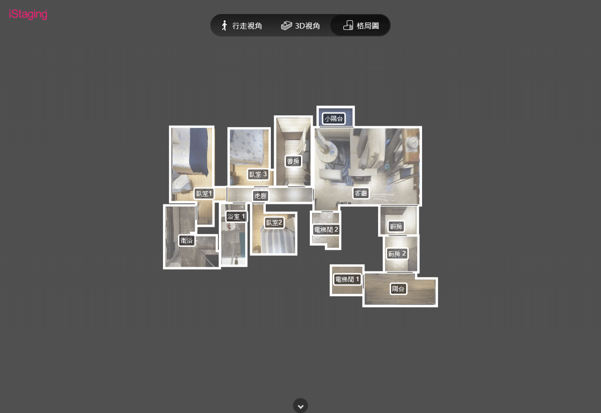 |

**飯店場地配置系統**

    將環景圖及場地平面圖通過描框、調整牆壁位置、調整貼圖角度、輸入實際場地大小、放置物品等階段，製造出可於場地內以第一人稱自由走動的網頁

|空間製作流程||
| ------------ | ------------- |
| 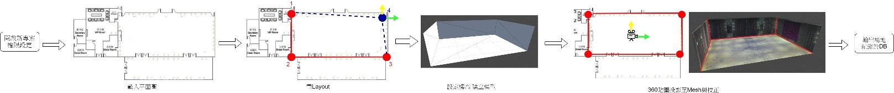||
|調整桌椅位置 & 自由走動的viewer||
| 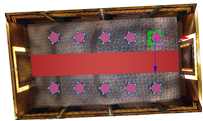 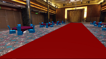||
|輸出的貼圖及模型 方便人工修正||
| 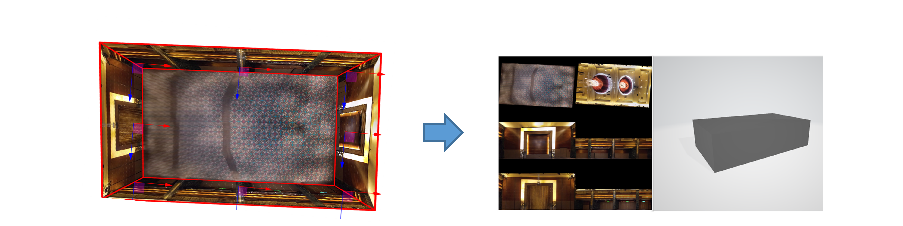||

## Cocos Creator

**卡牌遊戲前端**

    使用Cocos Creator 製作卡牌遊戲-鬥地主前端，包含動畫、音效、介面、封包接送等等，前期自行以Nodejs撰寫測試用的後台，最終根據他們所提供的規格書串接對方後台，並使用unity uniwebview 插件接上遊戲大廳。

    

|鬥地主 ||
| ------------- | ------------- |
| 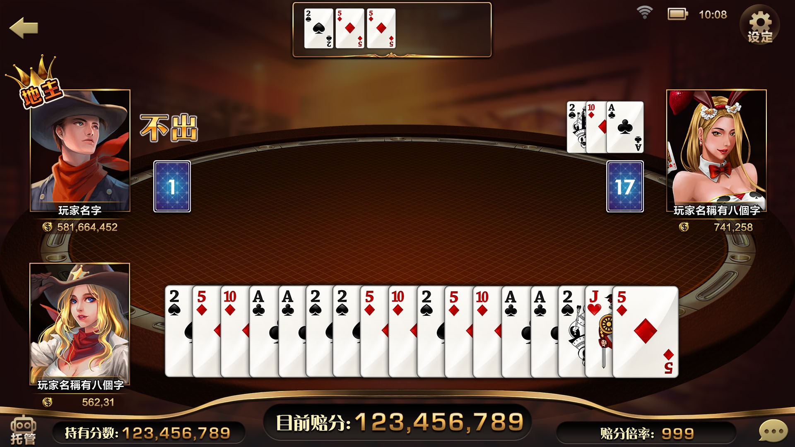  | 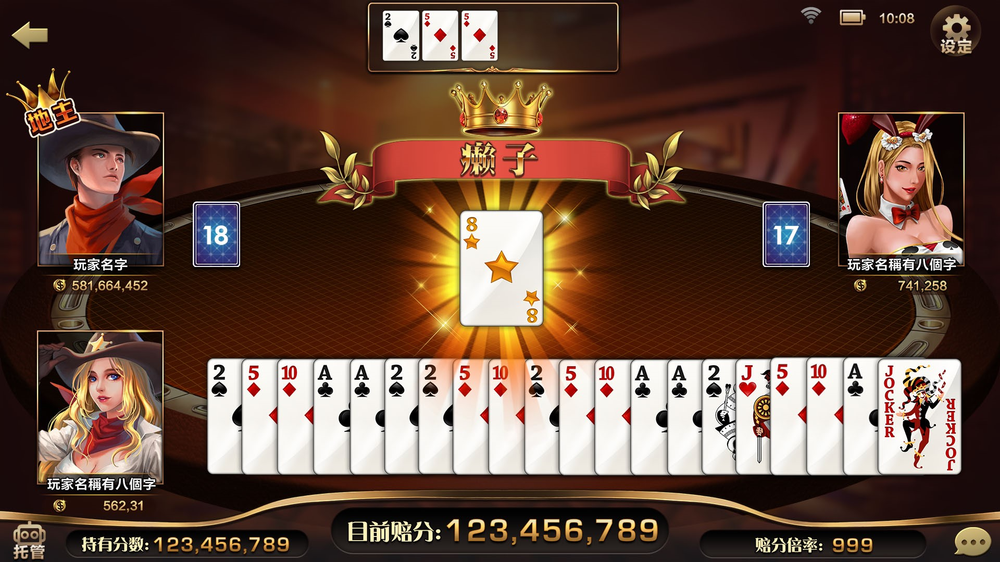 |
|  | 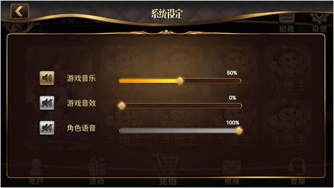 |

**老虎機前端**

    使用Cocos Creator 製作老虎機前端，包含動畫、音效、畫面、封包接送等等，根據合作公司的文件使用現有TypeScript程式框架, 最終階段透過mantis進行QA測試。

|S127-HauntedMansion ||
| ------------- | ------------- |
| 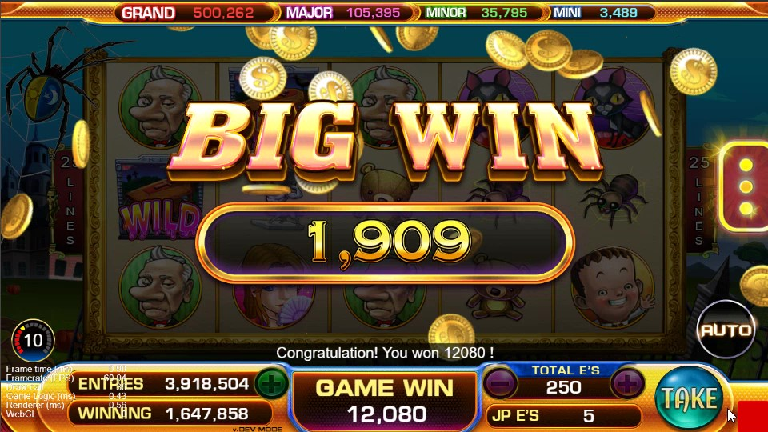  | 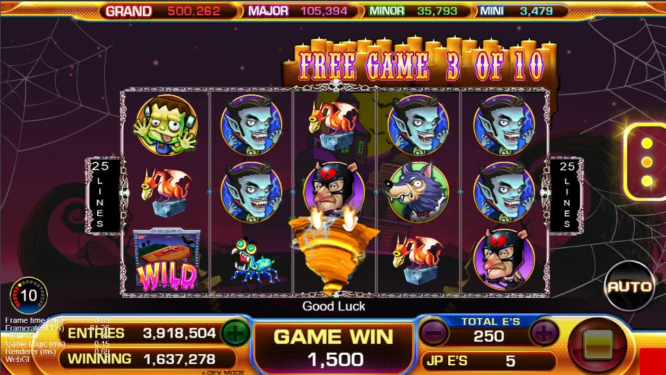 |
| 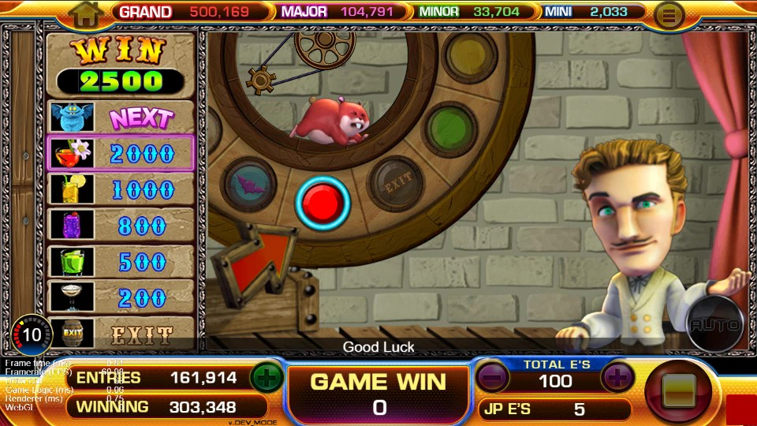 | 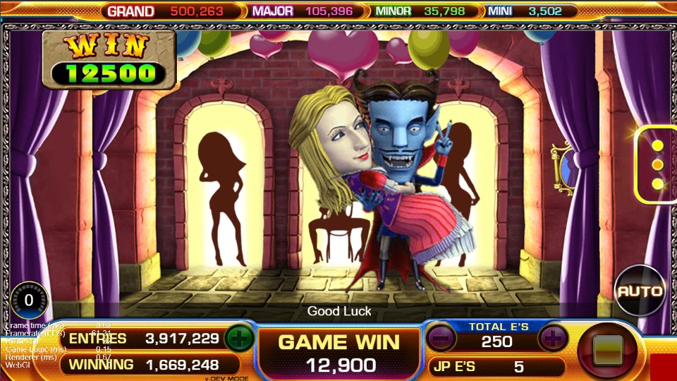 |

| S129 Orientaldragon ||||
| ----------------- | -------------- | --------- |--------- |
| 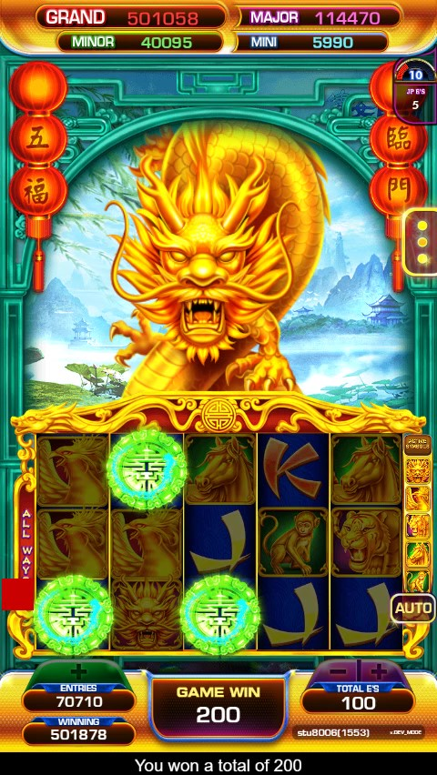| 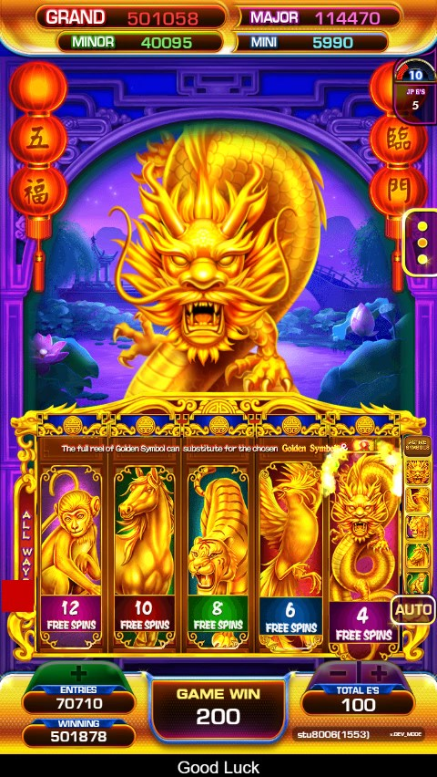 |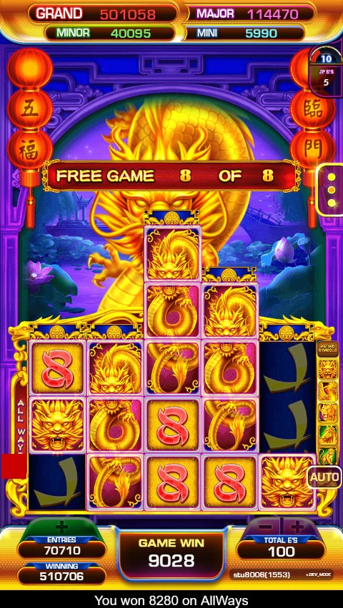 |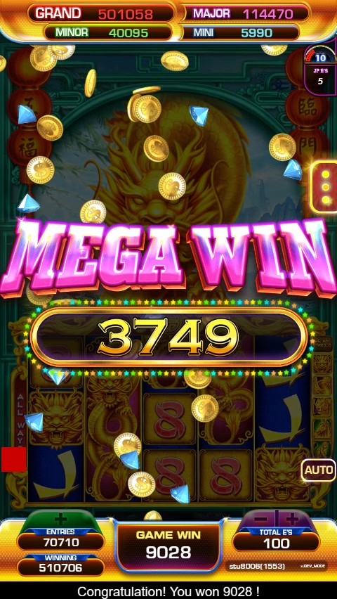 |

## Unity2D/3D

**遊戲程式設計作業**
- 迷宮遊戲

    

    

        使用unity3D遊戲引擎開發的一款遊戲，讓玩家透過簡單的提示字在迷宮找到出口，實做部分使用unity3D中的物理性質、UI、攝影機、粒子系統......等功能...
    

    
    <ul>
    <li>動畫 : 角色走路動畫、樹倒下的動畫、敵人走路攻擊動畫。</li>
    <li>UI : 關閉遊戲，重新遊戲、倒數計時畫面。</li>
    <li>光源 : 火把光源、死亡時的聚光燈。</li>
    <li>粒子系統 : 火把、光圈。</li>
    <li>場景 : 峽谷地形、星空skybox。</li>
    <li>攝影機 :  遊玩視角、小地圖視角。</li>
    <li>音效 : 背景音樂、攻擊聲、撿起道具聲、火把燃燒聲。</li>
    </ul>
    

    | 峽谷地形 | 粒子效果 | 死亡畫面 | 遊玩畫面 |
    | ----------------- | -------------- | --------- | --------- |
    | 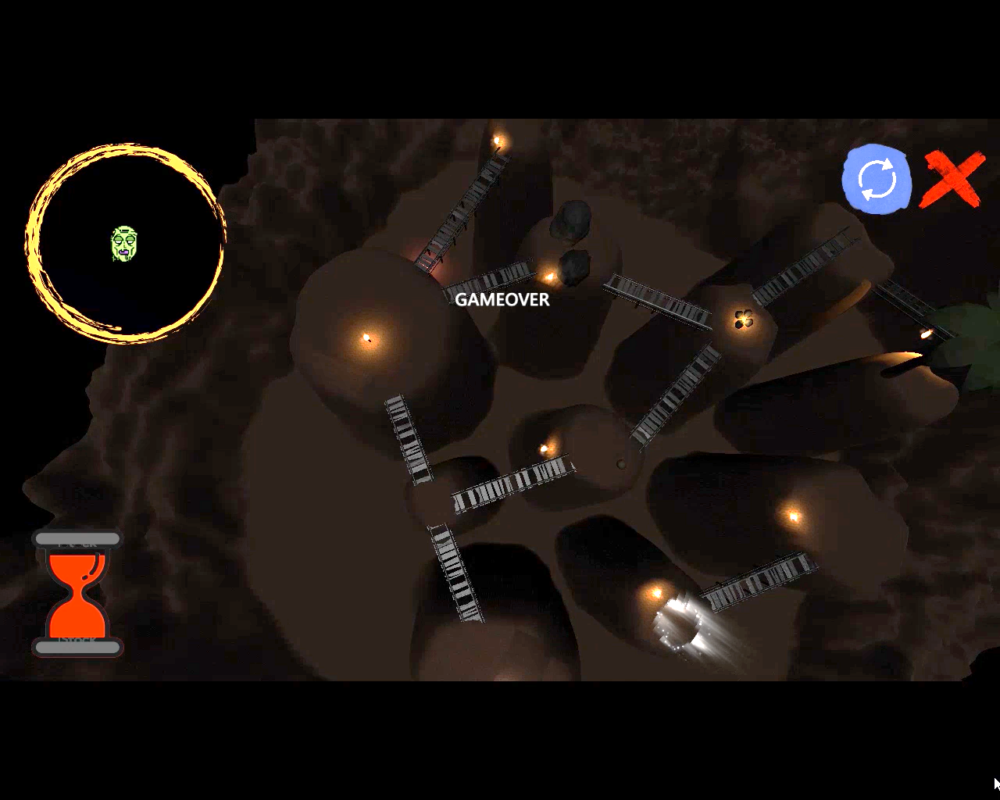| 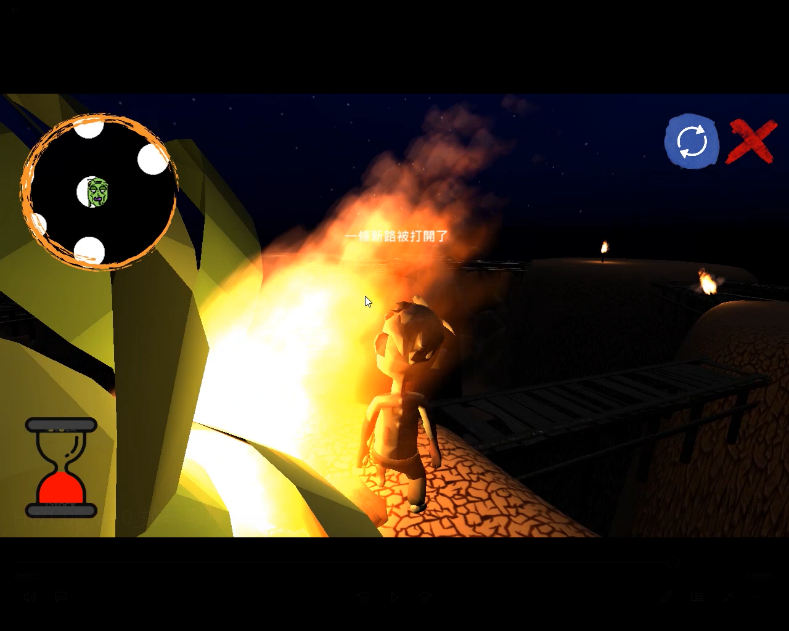 |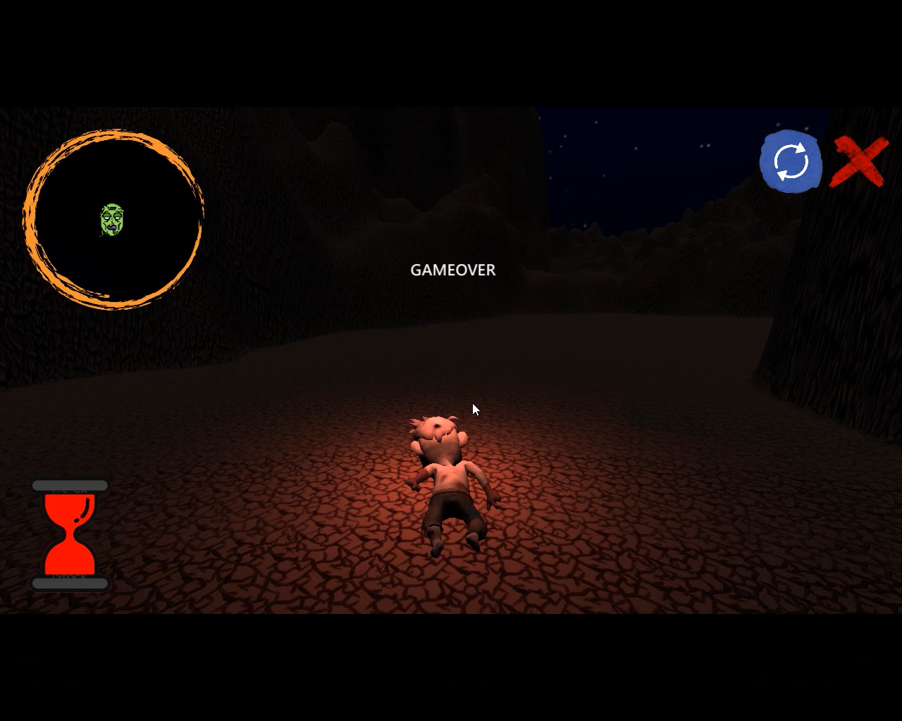 | 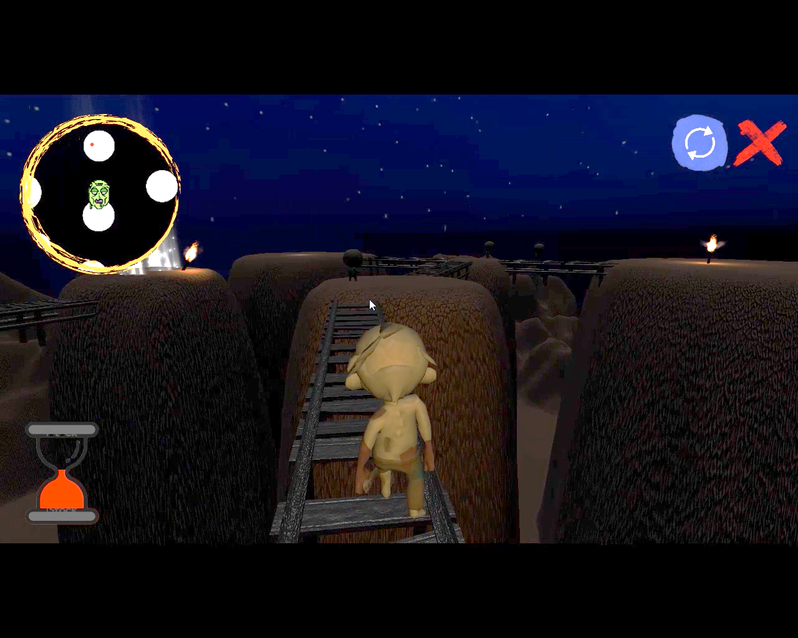 |

- 多人連線2D遊戲

    

    

        使用unity遊戲引擎開發的一款遊戲，通過發射子彈染色擊中的區域來佔領地盤，實做部分使用2D物理、圖片動畫、UI、連線......等功能...
    

    <ul>
    <li>物理 : 子彈打到物體後效果、單向門、子彈加速器。</li>
    <li>動畫: 用連續圖作敵人跳動動畫。</li>
    <li>連線 : 用Unet製作連線，同步玩家、時間、戰況。</li>
    <li>AssetBundle: 動態載入資源，方便更換圖片。</li>
    <li>Shader: 子彈特效，染色效果。</li>
    <li>UI: 連線介面。</li>
    </ul>
    

    | 動畫 | 子彈特效 | 遊玩畫面 |
    | ----------------- | -------------- | --------- |
    | 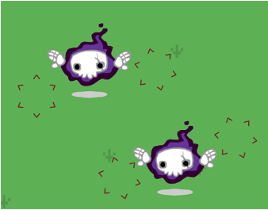| 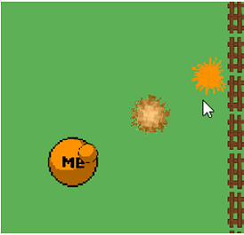 |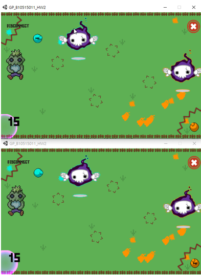 |

- Andriod 2D遊戲

    

    

        使用unity遊戲引擎開發的一款遊戲，通過陀螺儀上下躲避躲避來車，及觸碰螢幕發射子彈來破壞車輛，實做部分使用陀螺儀、多點觸控......等功能..
    

    <ul>
    <li>陀螺儀: 控制角色上下移動。</li>
    <li>多點觸控: 發射子彈。</li>
    <li>存讀檔: 儲存得分。</li>
    </ul>
    

    | 選單畫面 | 遊玩畫面 |
    | ------------- | ------------- |
    | 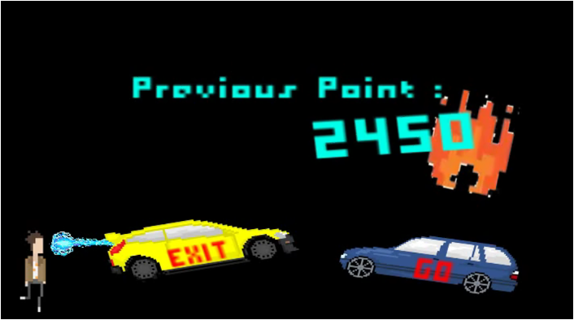  | 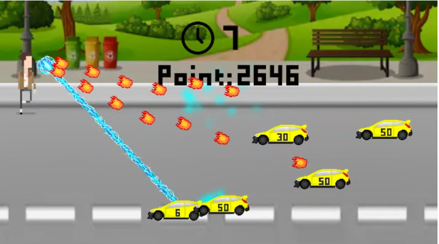 |

**遊戲企劃與設計原理作業-Boooom**
    

    Boooom是用unity3D遊戲引擎開發的一款多人搶地盤遊戲，過程包含文件撰寫、開發程式、測試除錯到最後DEMO，實作部分包含主遊戲外，還有控制角色用的web-App...

<ul>
<li>主遊戲 :主要核心玩法是透過丟水球佔領地盤，實作上使用shader更改vertex color再套用簡單的模糊遮罩，達到染色地板的效果。</li>
<li>控制器 : 開發使用unity3D遊戲引擎輸出webGL網頁，透過websocket傳輸簡單的上下左右、ready等資訊。</li>
<li><a href="https://www.youtube.com/watch?v=q7bf38KAHDw">遊戲介紹影片</a></li>
</ul>

|介紹影片 |選單畫面|
| ------------- | ------------- |
| 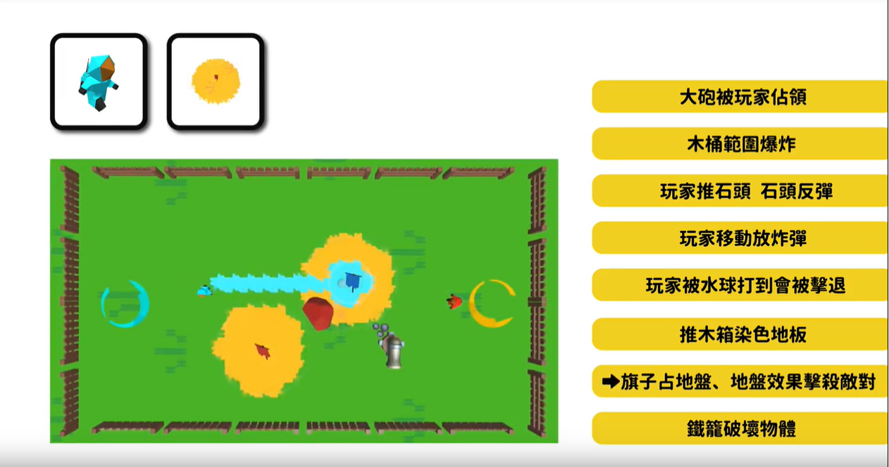  | 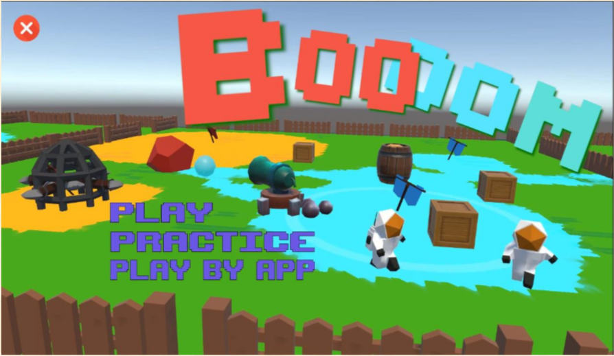 |
|遊玩畫面 | 等待畫面|
| 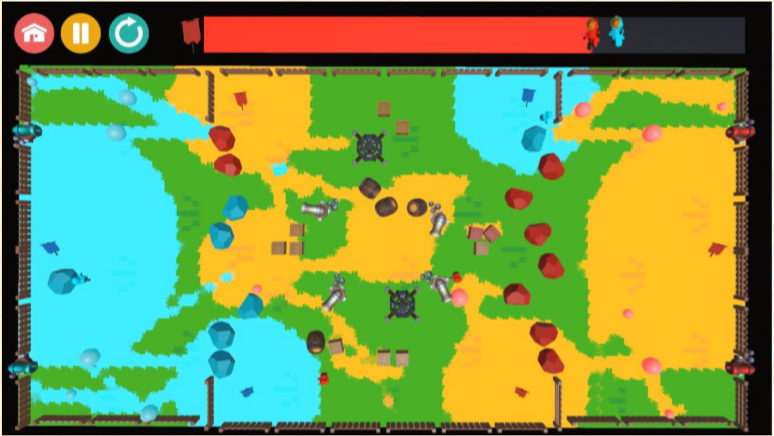 | 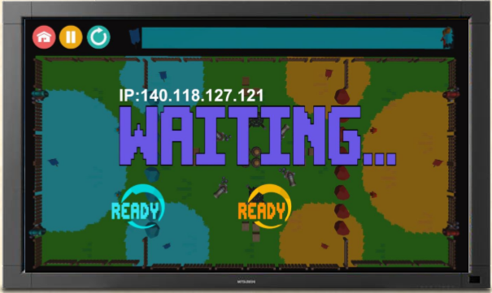 |

**設計系合作專題-Looptopia**

    與設計系同學合作，一款重現動物園動物「刻板行為」的網頁遊戲，讓更多人認識「刻板行為」，而「刻板行為」是指圈養動物因為壓力、孤立或無聊，而重複進行某個動作，例如籠子內不停的走來走去，重複的轉圈圈，或持續的咬某一個東西...

 進入遊戲後，成為一隻不知名的生物，被困在柵欄中，身旁只有一截樹墩、一碗飼料。你沒有事情做，只能無聊地操作手把，上、下、左、右，你不斷繞圈、橫衝直撞，碰到柵欄才停下來，偶爾按幾下「點頭」按鈕。終於，在你耗盡耐心前，天色漸漸暗了，遊戲裡的一天結束了，遊戲會結束，玩家可以離開，但遊戲裡的生物卻必須留在無止盡的循環中——就像動物園的動物一樣。
    
 遊戲實做的部分使用Cocos Creator 構建前端介面及表演動畫，之後將路線資訊傳到由Google App Script 所建立的簡單後台，並透過 API 儲存於 Google sheet中。

|開始選單 |被困住的2分鐘時間|
| ------------- | ------------- |
| 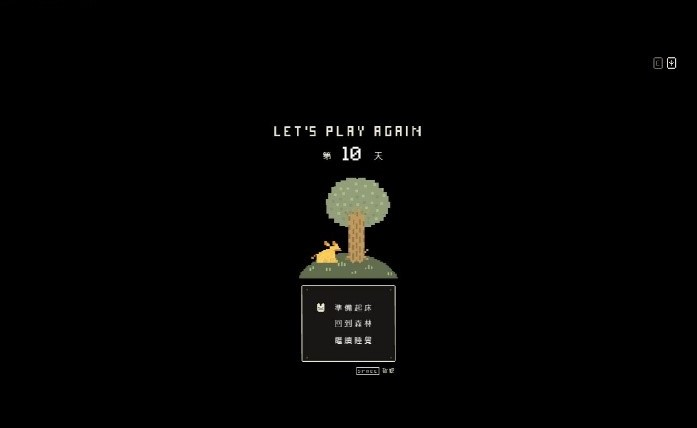  | 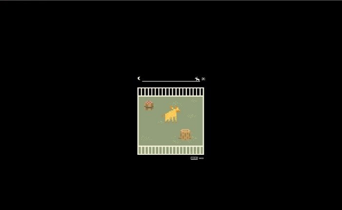 |
|重播2分鐘中所走的路徑 |所有歷史紀錄(走動動畫)|
| 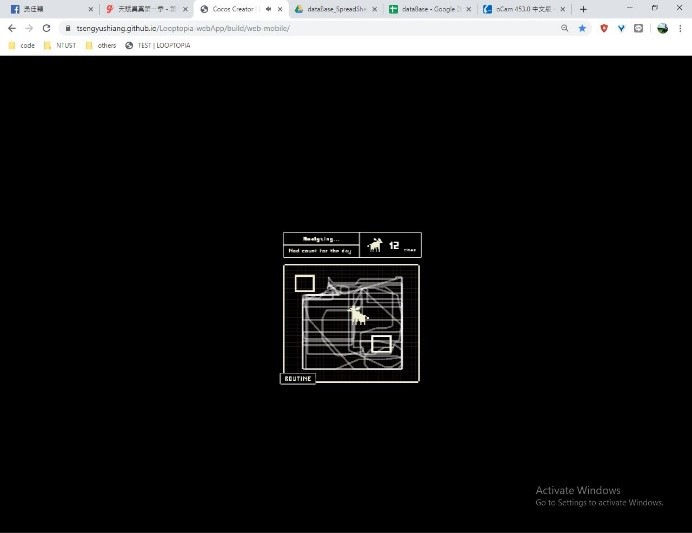 | 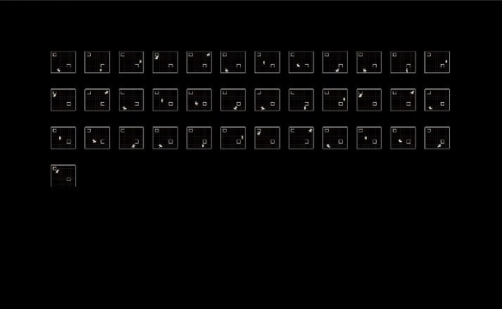 |

## OpenGL

**RGBD Camera viewer**

    使用OpenGL搭配imgui 2D介面, 同時繪製多台 RGBD Camera的影像、點雲, 並利用 cuda 加速效能...

    <ul>
    <li>RGBD Camera API 使用 : Azure Kinect, Realsense</li>
    <li>多台相機對齊 : 手動拖曳, OpenCV Aruco Marker 取得3D feature points </li>
    </ul>

| 介面 |多台相機點雲|
| ----------------- | -------------- |
| 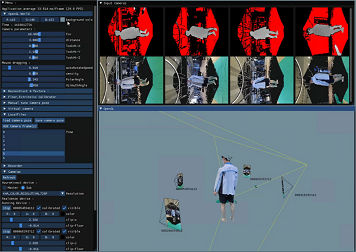|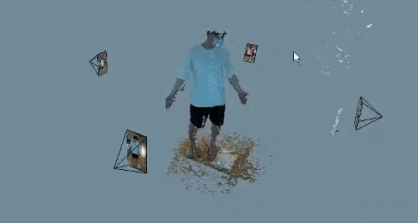 |

**基礎電腦圖學作業**
- 機器人

    

    

        使用OpenGL 內建基礎形狀繪製機器人，產生各個身體部位依序繪製，並使用階層式的矩陣完成動畫，再套用uv繪製貼圖
    
        
    

    | 動畫 |||||||
    | ----------------- | -------------- | --------- | --------- | --------- | --------- | --------- |
    | 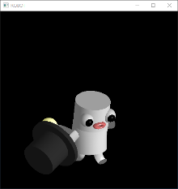|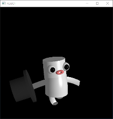 |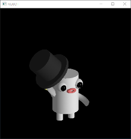 |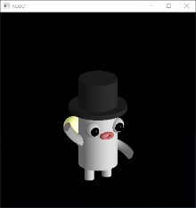 |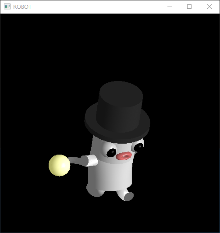 |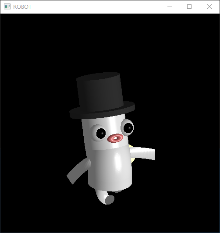 |

    | 貼圖 |||
    | ----------------- | -------------- | --------- |
    | 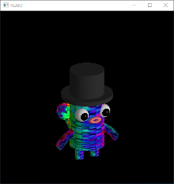|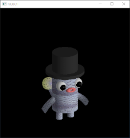 |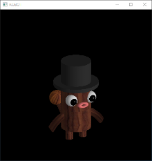 |

- Mesh貼圖

    

    

        使用OpenMesh 將載入的obj檔套用其資料結構方便運算，並透過反算相機矩陣選面，將選取範圍中的面參數化產生uv，最後貼上對應的貼圖。
    
        
    

    | 參數化結果 | 貼上貼圖 | 成品 |
    | ----------------- | -------------- | --------- |
    | 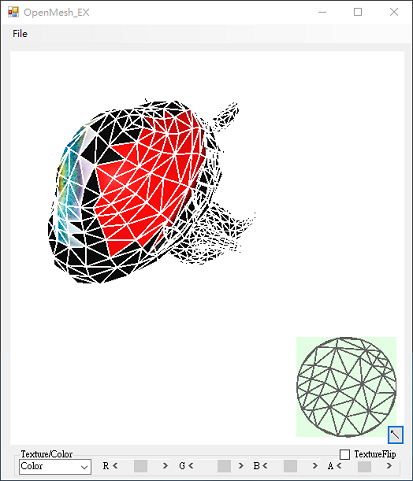| 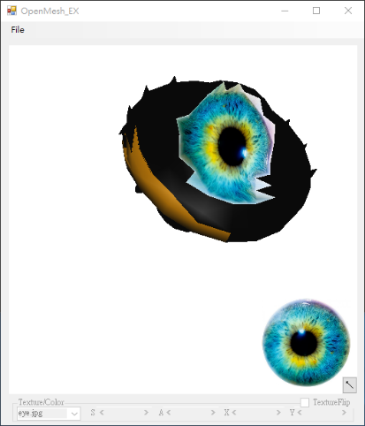 | |

- Shader特效

    

    

        讀取obj檔的資訊和模型矩陣傳入vertexShader做機器人動畫表演，搭配fragmentShader與framebuffer做畫面和貼圖的post processing，完成特效。
    
        
    

    | Toon  |Swirl distortion|CRT|Chromatic Aberration|
    | ----------------- | -------------- | --------- | --------- |
    | 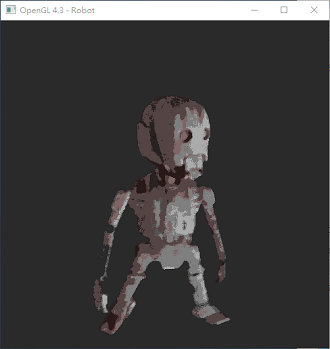|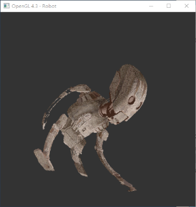 |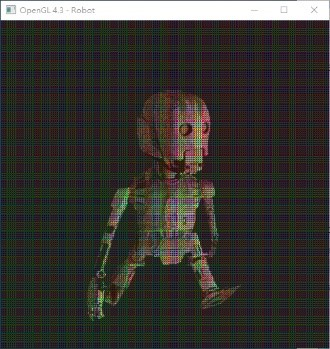 | |
    
    | 特效貼圖 |||
    | ----------------- | -------------- | --------- |
    | 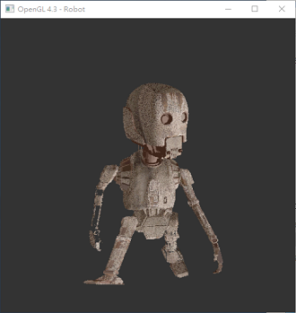 |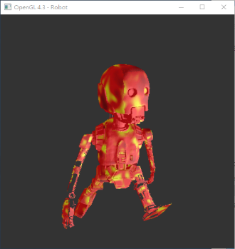 |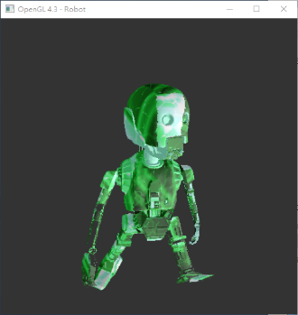 |

## Unreal, IOS, Nodejs

**Unreal 第一人稱射擊遊戲**

    使用Unreal遊戲引擎開發的第一人稱射擊遊戲，通過發射子彈來擊退敵人，實做部分使用粒子系統、UI、物理、AI......等功能...

<ul>
<li>粒子系統: 敵人生成特效、雷射槍。</li>
<li>物理: 子彈擊飛敵人。</li>
<li>UI : 開始、結束、暫停按鈕。</li>
<li>AI : 敵人自動追擊玩家。</li>
</ul>

| 選單畫面 | 遊玩畫面 |
| ------------- | ------------- |
| 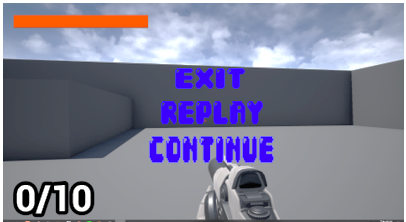  | 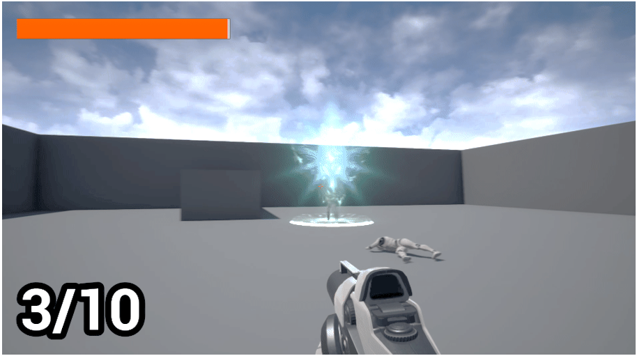 |

**IOS 2D橫向卷軸**

    使用IOS Game框架中的 Sprite Kit遊戲開發的殺殭屍遊戲，通過發射子彈來避免殭屍前進，實做使用連續圖製作殭屍及人物動畫，背景街道則用兩組重複圖連續移動達到無限循環的效果。

| 遊玩畫面 | 結算畫面 |
| ------------- | ------------- |
| 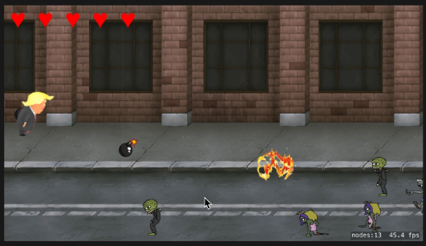  | 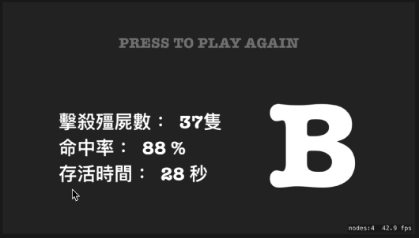 |

**留言平台(Cocos Creator, Nodejs, MySQL)**

    一個以五人小組根據MVC架構做的留言平台，過程包含文件撰寫、開發程式、測試除錯到最後DEMO...

功能 :
<ul>        
<li>使用者帳號密碼</li>
<li>新增、申請看板</li>
<li>發文、案讚、顯示熱門文章</li>
<li>新增、刪除好友、家族</li>
<li>管理員介面 :  刪除/凍結使用者、新增刪除看板</li>
</ul>
 實做工具:
<ul> 
<li>前端 :  Cocos Creator</li>
<li>後端 :  Nodejs express,socket.io</li>
<li>資料庫 : MySQL</li>
</ul>

| 登入頁面 | 管理者頁面 | 文章頁面 | 家族頁面 |
| ----------------- | -------------- | --------- | --------- |
| 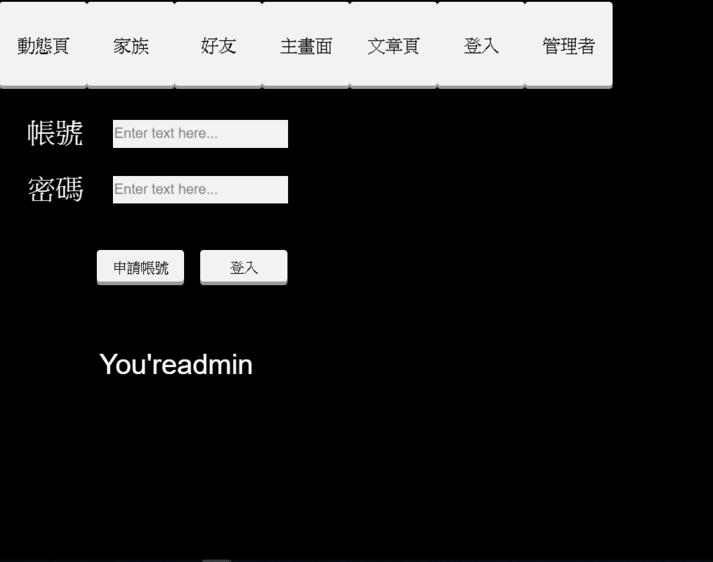| 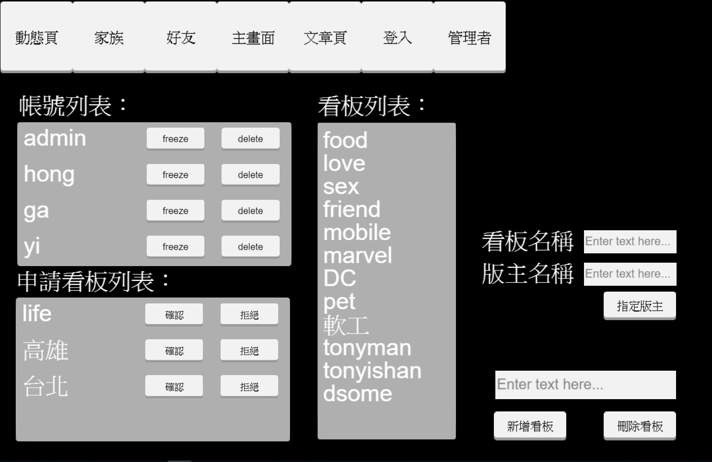 |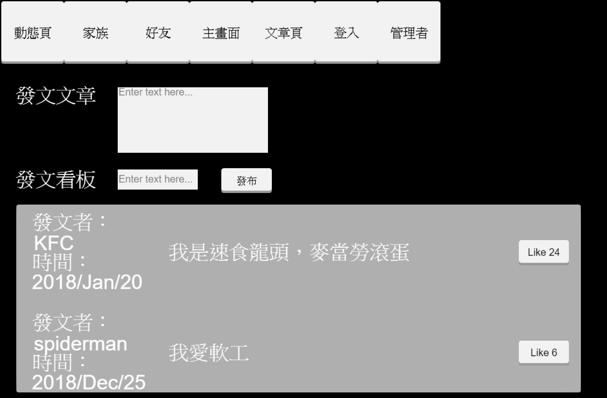 | 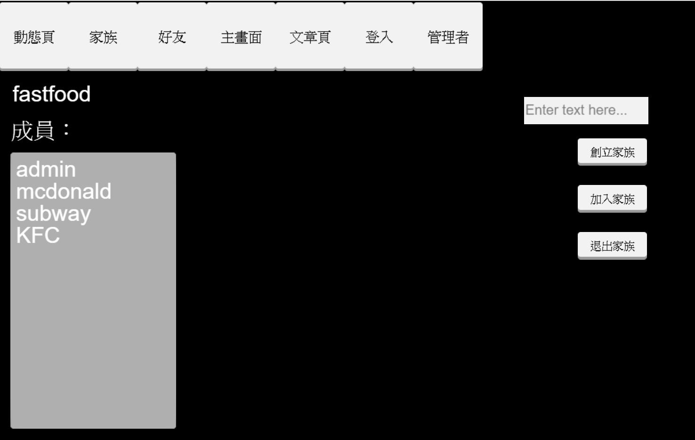 |